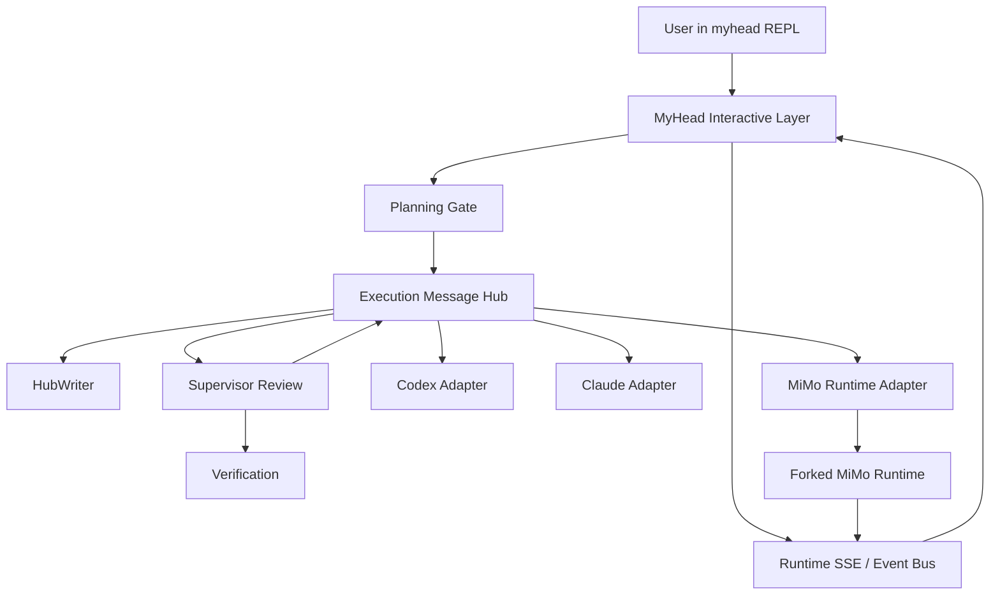

# MyHead 基于 MiMo-Code Runtime 二开实施计划

日期：2026-06-18

## 1. 结论

建议采用“中期路径”：在当前仓库根目录新建 `myhead/`，把 MiMo-Code 中可复用的 runtime 闭包复制进来，先保持可运行，再逐步改造成符合 MyHead docs 的终端监督控制平面。

这条路径的目标不是把 MiMo-Code 原样改名，也不是把 MyHead 做成 MiMo-Code 的一个插件。目标是复用 MiMo-Code 已经成熟的终端 / runtime 能力：

- TUI / REPL。
- MiMo TUI 样式、theme provider、默认 `mimocode` theme、prompt / dialog / status / footer / sidebar / message rendering 组件语言。
- SSE event bus。
- session / resume。
- SDK client。
- permission system。
- agent system。
- headless run / serve / ACP 相关能力。

然后新增 MyHead 自己的产品层：

- `myhead .` 唯一启动入口；进入 REPL 后用户 prompt 显示为 `>`。
- planning gate。
- confirmed implementation plan。
- execution message hub。
- HubWriter 单 writer / 原子写入。
- supervisor review。
- verification。
- Codex / Claude adapters。
- `.myhead/` 本地状态。
- Claude-Code-style streaming terminal transcript。
- Terminal conversation choreography：用户先和 MyHead 自然对话，确认后旁观 MyHead 指挥 Codex / Claude，必要时再被 MyHead 拉回决策。
- UI/UX 尽量复用 MiMo-Code 既有 TUI，不为 MyHead 新造一套终端视觉系统。

## 2. 设计判断

### 2.1 为什么不从零写

MyHead 最新产品要求已经变成“完全对标 Claude Code 的终端流式交互体验”。从零写 TUI、事件流、session、permission、tool rendering、resume 和 headless server，风险会集中在终端细节和异步状态机，而不是 MyHead 的核心监督能力。

MiMo-Code 已经有以下关键基础：

- `mimo run --format json`，可作为 headless run 的基础。
- `mimo serve`，可启动 headless server。
- ACP server，可作为未来客户端协议入口。
- `message.part.delta`，底层已经支持真正流式文本 delta。
- permission ask / reply 系统。
- session store / resume。
- TUI event rendering。

因此复用 runtime 比重写更稳。

### 2.2 为什么不整仓无差别复制

当前本地 MiMo-Code 约 140M。MyHead MVP 只需要本地终端 runtime，不需要 MiMo-Code 的 console、desktop、enterprise、web、containers、infra 和发布体系。

如果无差别复制，会带来：

- 依赖过大。
- 构建变慢。
- 产品边界混乱。
- 后续重命名和删减成本上升。
- 更容易把 MiMo-Code 的产品心智带进 MyHead。

所以首批复制应以 runtime 闭包为单位，而不是全仓搬运。

## 3. 目标目录结构

建议新建：

```text
myhead/
  README.md
  LICENSE
  THIRD_PARTY_NOTICES.md
  package.json
  bun.lock
  bunfig.toml
  tsconfig.json
  turbo.json
  patches/
  packages/
    runtime/          # 从 packages/opencode 复制后逐步改名
    sdk/              # 从 packages/sdk 复制
    plugin/           # 从 packages/plugin 复制
    shared/           # 从 packages/shared 复制
    ui/               # 从 packages/ui 复制
    myhead-core/      # 新增：MyHead planning / hub / review / verify / adapters
  docs/
    runtime-fork-notes.md
```

首批也可以保持原包名不动：

```text
myhead/packages/opencode
myhead/packages/sdk
myhead/packages/plugin
myhead/packages/shared
myhead/packages/ui
```

等能跑通后再改名为 `runtime` / `myhead-runtime`。不建议复制后立刻大规模改 import 名称。

## 4. 复制清单

### 4.1 必须复制

```text
MiMo-Code/package.json
MiMo-Code/bun.lock
MiMo-Code/bunfig.toml
MiMo-Code/tsconfig.json
MiMo-Code/turbo.json
MiMo-Code/patches/
MiMo-Code/LICENSE
MiMo-Code/USE_RESTRICTIONS.md
MiMo-Code/packages/opencode/
MiMo-Code/packages/sdk/
MiMo-Code/packages/plugin/
MiMo-Code/packages/shared/
MiMo-Code/packages/ui/
```

### 4.2 可选复制

```text
MiMo-Code/README.md
MiMo-Code/README.zh.md
MiMo-Code/CONTRIBUTING.md
MiMo-Code/SECURITY.md
MiMo-Code/AGENTS.md
MiMo-Code/.oxlintrc.json
MiMo-Code/.editorconfig
MiMo-Code/.prettierignore
```

这些文件复制后要改成 MyHead 语义，不能继续暗示产品是 MiMoCode。

### 4.3 暂不复制

```text
MiMo-Code/.git/
MiMo-Code/.github/
MiMo-Code/.husky/
MiMo-Code/.mimocode/
MiMo-Code/assets/
MiMo-Code/infra/
MiMo-Code/nix/
MiMo-Code/script/release*
MiMo-Code/packages/app/
MiMo-Code/packages/console/
MiMo-Code/packages/containers/
MiMo-Code/packages/desktop/
MiMo-Code/packages/enterprise/
MiMo-Code/packages/extensions/
MiMo-Code/packages/function/
MiMo-Code/packages/identity/
MiMo-Code/packages/slack/
MiMo-Code/packages/storybook/
MiMo-Code/packages/web/
```

后续如果发现 runtime 仍依赖其中某些包，再按依赖补齐，不预先搬空。

## 5. 分阶段实施

### Phase 0：Vendor Runtime Baseline

目标：复制 runtime 闭包到 `myhead/`，并在不做产品改造的前提下验证可构建、可启动。

任务：

1. 新建 `myhead/`。
2. 复制 4.1 必须清单。
3. 保留 MIT license 和原 copyright。
4. 新建 `THIRD_PARTY_NOTICES.md`，说明 runtime 来源于 MiMo-Code / OpenCode，保留原许可证。
5. 修改根 `myhead/package.json` 的 name 和 scripts，但先不大改 workspace 内包名。
6. 跑最小命令：
   - `bun install`。
   - `bun --cwd packages/opencode test` 或等价最小测试。
   - `bun --cwd packages/opencode src/index.ts --help`。

验收：

- `myhead/` 下依赖能安装。
- runtime CLI 能显示 help。
- 不要求此阶段符合 MyHead 产品体验。
- 原始 `MiMo-Code/` 目录不被修改。

### Phase 1：Runtime 命名与入口收敛

目标：把 runtime 从 MiMoCode 语义收敛到 MyHead 语义，但仍保持功能可跑。

任务：

1. CLI script name 从 `mimo` 改成 `myhead`。
2. binary 从 `mimo` 改成 `myhead`。
3. 默认入口从 `mimo` / TUI home 改成 `myhead .`。
4. 拒绝：
   - `myhead`
   - `myhead <path>`
   - `myhead --workspace <path>`
   - `myhead . --workspace <path>`
5. 配置目录从 `.mimocode` 迁移到 `.myhead`，但保留兼容读取开关以便调试。
6. 全局环境变量从 `MIMOCODE_*` 逐步迁移到 `MYHEAD_*`。

验收：

- `myhead .` 能进入 REPL，交互 prompt 显示为 `>`。
- 错误入口给出简短错误。
- 不再把 MiMo Auto、MiMo OAuth、MiMo branding 作为默认产品入口。

### Phase 2：Streaming Terminal Contract

目标：符合 `docs/Terminal-streaming-ux-contract-claude-code-style-2026-06-18.md`。

交互细节必须同时符合 `docs/Terminal-conversation-choreography-2026-06-18.md`。这一阶段不只是接通事件流，还要证明用户能自然地从 planning chat 进入 live transcript，并且执行期普通输入不会被误派给 worker。

任务：

1. 保留并复用 MiMo-Code 的 SSE event bus。
2. MyHead interactive 层消费 runtime event stream。
3. 直接使用或适配 `message.part.delta`，确保 worker visible text 在子进程结束前逐段出现。
4. 默认 transcript 显示：
   - MyHead status。
   - MyHead dispatch。
   - worker visible text。
   - review started / completed。
   - verification started / completed。
   - loop closed。
5. 默认折叠：
   - raw stdout / stderr。
   - thinking。
   - tool noise。
   - debug artifact。
6. `logs`、`show`、`history` 作为回看入口，不作为默认执行观察路径。
7. 实现顶层交互状态：
   - `planning_chat`
   - `plan_ready`
   - `execution_starting`
   - `live_transcript`
   - `needs_user_decision`
   - `loop_closed`
8. 每次状态转换显示短状态路标：
   - `plan ready`
   - `hub created`
   - `live transcript started`
   - `decision needed`
   - `loop closed`
9. 先用 fake worker 验证完整交互编排，再接真实 Codex / Claude / MiMo worker。
10. MyHead 新增 planning / hub / review / verification UI 必须基于 MiMo theme token 和现有 TUI 组件语言实现。

验收：

- 用户确认执行后自动显示 `hub created`。
- 自动显示 `live transcript started`。
- worker visible text 在进程结束前逐段显示。
- review / verification 事件逐段显示。
- loop closed 后回到 `>` prompt。
- 执行期间普通文本不会被静默当作新任务派给 worker。
- `needs_user_decision` 状态下，用户输入才作为执行决策写入 hub。
- fake worker 可以模拟慢速 token delta、长时间无输出、permission ask、verification fail、needs_user_decision 和 Ctrl+C。
- 新增 UI 看起来像 MiMo TUI 的监督层扩展，而不是另一套 CLI。

### Phase 3：MyHead Core Layer

目标：新增 MyHead 自己的产品事实来源，而不是继续使用 runtime session 作为唯一事实来源。

新增包：

```text
myhead/packages/myhead-core/
  src/
    workspace/
    config/
    planning/
    hub/
    review/
    verify/
    adapters/
    controller/
    artifacts/
```

任务：

1. 实现 workspace 绑定，只允许 `myhead .`。
2. 实现 `.myhead/config.json`，只配置 MyHead 自己的模型。
3. 实现 planning prompt 和实施方案生成。
4. 实现 plan ready / edit / cancel / execute gate。
5. 实现 `.myhead/runs/<run-id>/plan.md`。
6. 实现 `.myhead/runs/<run-id>/task.json`。

验收：

- 规划对话默认不进入 execution hub。
- 用户确认后的 plan 成为唯一执行事实来源。
- cancel 不创建 execution hub。

### Phase 4：Message Hub 与 HubWriter

目标：实现 MyHead docs 要求的 execution message hub。

任务：

1. 实现 `.myhead/sessions/<hub-id>.json` schema。
2. 实现 `HubWriter`：
   - 单队列串行 mutator。
   - 临时文件写入。
   - 原子 rename。
   - 失败保持 last good state。
3. 将 runtime event stream 映射成 MyHead `HubMessage`。
4. 建立 `visibility = "hub" | "debug"`。
5. 支持 pendingQueue。
6. 支持 contextSnapshot / seenHubOffset。
7. 支持 resumeCheckpoint。

验收：

- 100 个并发 append 后 JSON 可解析。
- `hubLog` 顺序稳定。
- pendingQueue 不丢。
- execution transcript 来自 hub，而不是临时 stdout。

### Phase 5：Supervisor Review 与 Verification

目标：MyHead 成为 supervisor，而不是只是 runtime 包装器。

任务：

1. 接入 OpenAI SDK / Anthropic SDK。
2. 实现 `completeJson(messages, schema)`。
3. 定义 review schema：
   - `accepted`
   - `continue`
   - `revise`
   - `verify`
   - `needs_user_decision`
   - `failed`
   - `blocked`
4. review 输入包含：
   - confirmed plan。
   - hubLog。
   - worker response。
   - diff。
   - verification evidence。
   - blocked events。
5. 实现 verification commands。
6. diff / changed files 进入 artifact。

验收：

- supervisor 不把 worker 自述当证据。
- review 结果写入 hub turns。
- verification 失败能驱动下一轮修正或用户决策。

### Phase 6：Worker Adapter 层

目标：在 runtime 之外接入 Codex / Claude / MiMo worker。

初始 adapters：

```text
adapters/
  codex.ts
  claude.ts
  mimo.ts
```

Codex adapter 固定路径继续遵守现有 docs：

```text
codex exec --cd <worker-cwd> --dangerously-bypass-approvals-and-sandbox --json --output-last-message <artifact> -
codex exec --cd <worker-cwd> --dangerously-bypass-approvals-and-sandbox resume --json --output-last-message <artifact> <session-id> -
```

Claude adapter 固定路径继续遵守现有 docs：

```text
claude -p --verbose --output-format stream-json --dangerously-skip-permissions --append-system-prompt-file <file> --session-id <uuid> <prompt>
claude -p --verbose --output-format stream-json --dangerously-skip-permissions --resume <session-id> <prompt>
```

MiMo adapter 初始路径：

```text
myhead-runtime run --format json --dangerously-skip-permissions --dir <worker-cwd> --agent build <prompt>
myhead-runtime run --format json --dangerously-skip-permissions --dir <worker-cwd> --session <session-id> <prompt>
```

更优路径：

- 直接接 runtime server SDK / SSE，而不是只包 CLI。
- 消费 `message.part.delta` 作为 worker visible text。

验收：

- adapter 不通过 shell 字符串拼接命令。
- capability probe 失败则 blocked。
- no-approval mode 和 cwd 写入 hub JSON。
- worker ask / permission prompt 按 MyHead 语义记录。

### Phase 7：权限语义收紧

目标：把 MiMo-Code 的 permission system 改造成 MyHead 的监督语义。

差异：

- MiMo-Code `--dangerously-skip-permissions` 会自动批准未显式 deny 的 permission。
- MyHead docs 要求“不透出审批；固定 no-approval 不成立或仍出现 ask 时 blocked”。

策略：

1. MyHead 启动 worker 前显示 no-approval 风险摘要。
2. run metadata 记录 permission mode。
3. 对 Codex / Claude：出现审批 / ask 直接 blocked。
4. 对 MiMo runtime：初期允许 `--dangerously-skip-permissions` 自动 reply，但必须记录 permission event。
5. 若要严格符合 MyHead，后续改 runtime：
   - permission ask 不自动继续。
   - 进入 blocked。
   - hub 写入 blockedEvent。

验收：

- 用户不会在 worker 执行中被权限 UI 打断。
- 高风险自动权限被记录。
- blocked / failed 分类稳定。

### Phase 8：Compare 与 Worktree Isolation

目标：实现 MyHead 的多 worker 比较能力。

任务：

1. `exec both` / `compare` 创建单个 execution hub。
2. Codex 和 Claude 默认隔离 worktree。
3. MiMo worker 也可以作为第三个 compare worker，但 MVP 可以后置。
4. git repo 使用 `git worktree`。
5. 非 git repo 使用临时副本。
6. 无法隔离则 blocked。
7. 不自动合并冲突 diff。

验收：

- 两个 worker 的 cwd、diff、verification 分开记录。
- 一个 worker 失败不丢另一个结果。
- supervisor 给出推荐和理由。

## 6. 技术风险

### R1. import / package name 大量耦合

MiMo-Code 内部大量使用 `@mimo-ai/*` workspace 包名。第一阶段不要急着改包名。先复制后跑通，再建立批量重命名计划。

控制：

- Phase 0 保留原包名。
- Phase 1 只改 binary / product entry。
- 包名迁移作为独立 PR。

### R2. TUI 与 runtime 过度耦合

TUI 可能依赖 `@mimo-ai/ui`、theme、plugin runtime 和 config shape。

控制：

- 首批复制 `ui` 和 `plugin`。
- 不提前拆 TUI。
- MyHead layer 通过 event contract 接入，不直接改深层组件。

### R3. `mimo run --format json` 不是完整 text delta 流

当前 CLI run path 更偏完成后 text part emit；底层 event bus 有 `message.part.delta`。

控制：

- MyHead streaming 不只依赖 `run --format json`。
- 优先接 server SSE / SDK。
- 或修改 run command 输出 `message.part.delta`。

### R4. MiMo permission 与 MyHead blocked 语义不同

控制：

- 先记录 permission event。
- 后续引入 MyHead policy adapter。
- 明确区分 “auto-approved by runtime” 和 “blocked by MyHead policy”。

### R5. 复制后技术债过大

控制：

- 建立 `runtime-fork-notes.md`。
- 每个改动标注是 vendor sync、branding、MyHead layer 还是 deletion。
- 不在 Phase 0 删除大量代码。

### R6. 许可证和品牌

MiMo-Code 是 MIT，可以二开，但必须保留 copyright 和 license。MiMo 名称、Logo、托管服务和商标不能混用为 MyHead 品牌。

控制：

- 保留 `LICENSE`。
- 新增 `THIRD_PARTY_NOTICES.md`。
- README 明确 MyHead includes code derived from MiMo-Code / OpenCode。
- 默认产品 UI 不使用 MiMo logo / hosted service 文案。

## 7. 最小验收矩阵

| 阶段 | 最小验收 |
| --- | --- |
| Phase 0 | `myhead/` runtime 能安装依赖并显示 CLI help |
| Phase 1 | `myhead .` 是唯一默认入口，错误 path 被拒绝 |
| Phase 2 | 确认执行后自动显示 hub live transcript |
| Phase 3 | confirmed plan 保存，cancel 不创建 hub |
| Phase 4 | hub JSON 单 writer 原子写入，并发测试通过 |
| Phase 5 | supervisor review 结构化输出并写入 hub |
| Phase 6 | Codex / Claude / MiMo 至少一个 adapter 跑通 two-turn fake E2E |
| Phase 7 | no-approval 风险和 permission events 可审计 |
| Phase 8 | compare 默认隔离 worktree，不自动 merge |

## 8. 第一批具体任务

建议按以下任务开工：

1. 创建 `myhead/` 目录。
2. 复制 runtime 闭包。
3. 创建 `myhead/THIRD_PARTY_NOTICES.md`。
4. 调整 `myhead/package.json`：
   - name: `myhead-runtime-fork` 或 `myhead`。
   - bin: 暂时保留 `mimo`，新增 `myhead`，后续再删除 `mimo`。
5. 跑 `bun install`。
6. 跑 runtime help。
7. 新增 `packages/myhead-core` 空包。
8. 写第一个测试：`myhead .` 参数解析。
9. 新增 `MyHeadInteractiveEvent` 类型。
10. 写 adapter spike：从 MiMo SSE 中消费 `message.part.delta`。

## 9. 首批 PR 拆分

为了避免一次性复制后失去控制，建议把二开启动拆成 6 个小 PR / commit group。每个 group 都应能独立解释、独立回滚。

### PR-1：Vendor baseline

范围：

- 新建 `myhead/`。
- 复制 4.1 runtime 闭包。
- 新增 `myhead/THIRD_PARTY_NOTICES.md`。
- 不改业务逻辑。

验收：

- `myhead/` 存在。
- license / use restrictions 被保留。
- `git diff --stat` 能看出这是 vendor baseline，不混入 MyHead 产品逻辑。

### PR-2：Install / help baseline

范围：

- 调整 `myhead/package.json` workspace，先排除未复制包。
- 移除或禁用 root scripts 中指向 desktop / web / console 的入口。
- 保留 `packages/opencode` 原包名与 import。

验收：

- `bun install` 不因为未复制 package workspace 失败。
- runtime CLI help 可显示。
- 若依赖安装受网络限制，记录失败原因，不做伪通过。

### PR-3：MyHead binary shell

范围：

- 新增 `myhead` bin。
- 暂时允许内部仍调用 opencode / mimo runtime。
- 实现 `myhead .` 参数门。
- 错误入口给清晰提示。
- 保持 MiMo prompt / keybinding / theme 行为，不在入口层重做 prompt。

验收：

- `myhead .` 进入交互入口。
- `myhead`、`myhead ..`、`myhead /tmp/x`、`myhead --workspace .` 被拒绝。

### PR-4：MyHead core skeleton

范围：

- 新增 `packages/myhead-core`。
- 定义 workspace、plan、hub、review、verify、adapter 的 public types。
- 不接真实 worker。

验收：

- 类型测试通过。
- `MyHeadInteractiveEvent` 与 streaming UX contract 对齐。
- `.myhead/` 路径只在 core 层定义，不散落到 runtime 深处。

### PR-5：HubWriter + fake worker E2E

范围：

- 实现 `HubWriter`。
- 实现 fake streaming worker。
- 实现最小 controller loop：plan accepted -> hub created -> worker delta -> review fake -> loop closed。
- 实现最小 terminal choreography：planning_chat -> plan_ready -> execution_starting -> live_transcript -> loop_closed。
- 模拟 execution 中用户普通输入，验证不会静默派给 worker。
- 使用 MiMo TUI 组件语言渲染 fake live transcript，不用临时 console log 风格替代最终体验。

验收：

- 100 次 append 后 hub JSON 可解析。
- fake worker 输出在完成前进入 live transcript。
- loop closed 后回到 `>` prompt。
- `needs_user_decision` 能把用户从旁观状态自然拉回对话。
- fake E2E 的视觉和交互基调接近 MiMo TUI：prompt、状态、muted text、success / warning / error、边框和消息渲染一致。

### PR-6：真实 runtime adapter spike

范围：

- 优先接 MiMo runtime server SSE / SDK。
- 如果 SSE 接入成本过高，临时使用 `run --format json`，但必须标记为非最终 streaming 实现。
- 解析 `message.part.delta`。

验收：

- 至少一个真实 worker 的可见文本能流式进入 hub。
- permission asked / replied 事件能进入 debug hub message。
- 不能只在 worker 结束后写最终 summary。

## 10. 验收命令与手工体验

Phase 0 / Phase 1 的命令以实际复制后的 package scripts 为准，首选：

```text
cd myhead
bun install
bun --cwd packages/opencode test --timeout 30000
bun --cwd packages/opencode src/index.ts --help
bun --cwd packages/opencode src/index.ts . --help
```

MyHead 产品验收必须包含手工体验，不只看单元测试：

```text
cd <any-git-workspace>
myhead .

> 修改一个小文档错别字，并运行验证
MyHead: streaming plan...
> codex
MyHead: hub created: ...
MyHead: live transcript started
MyHead -> codex: ...
codex: streaming visible response...
MyHead: review started...
MyHead: verification started...
MyHead: loop closed: accepted
>
```

失败判定：

- 如果用户确认后需要手动输入 hub id，失败。
- 如果用户确认后没有明确状态路标，失败。
- 如果用户消息在 live transcript 中被额外渲染成 `User:`、`user:`、`myhead>` 等前缀，失败。
- 如果 MyHead 新增 UI 没有复用 MiMo theme token / prompt / message rendering，失败。
- 如果 worker 完成前没有任何可见文本，失败。
- 如果 review / verification 只在最终摘要出现，失败。
- 如果执行中普通用户输入被静默当作 worker 新任务，失败。
- 如果 `.myhead/sessions/*.json` 损坏或不可重放，失败。

## 11. 测试策略

### Unit tests

- workspace 参数解析：只允许 `myhead .`。
- `.myhead` 路径解析：拒绝相对 home / 非 workspace 写入。
- `HubWriter` append / update / pendingQueue / crash recovery。
- `MyHeadInteractiveEvent` schema。
- adapter JSONL / stream-json / SSE delta parser。

### Integration tests

- fake worker two-turn loop。
- fake permission ask -> blocked / debug event。
- verification failure -> supervisor `continue`。
- cancel at plan gate -> no hub created。
- resume hub -> continues from `seenHubOffset`。

### Manual tests

- 窄终端宽度下 transcript 不错乱。
- Ctrl+C 一次提示，二次取消并保存状态。
- worker 输出大量文本时仍保持流式。
- network / model failure 时进入 blocked，而不是吞错或假成功。

### Regression tests from MiMo runtime

复制后保留 MiMo runtime 原测试的可运行子集。若某些测试依赖未复制的 console / web / hosted service，需要在 fork notes 中标注：

- skipped reason。
- 是否和 MyHead runtime 有关。
- 后续是否要恢复。

## 12. Vendor 同步与重命名策略

### Vendor sync

Phase 0 后建立 `myhead/docs/runtime-fork-notes.md`，每次改 forked runtime 都记录类别：

- `vendor-copy`：原样来自 MiMo-Code。
- `vendor-adapt`：为了在 MyHead 仓库运行而做的最小适配。
- `myhead-product`：MyHead 产品语义改动。
- `deletion`：删除未使用 MiMo 功能。

这样后续如果要从上游 MiMo-Code 合并 bugfix，可以判断冲突来自哪里。

### 命名迁移

迁移顺序：

1. binary / command 文案：`mimo` -> `myhead`。
2. storage / env：`.mimocode`、`MIMOCODE_HOME` -> `.myhead`、`MYHEAD_HOME`。
3. public package name：`@mimo-ai/*` -> `@myhead/*`。
4. deep internal names。

不建议在 Phase 0 同时做 2、3、4。包名迁移应有独立测试和独立 diff。

## 13. 数据与状态设计约束

MyHead 至少有三层状态，不能混用：

| 状态 | 位置 | 作用 |
| --- | --- | --- |
| plan artifact | `.myhead/runs/<run-id>/plan.md` | 用户确认的实施方案 |
| task metadata | `.myhead/runs/<run-id>/task.json` | worker、cwd、permission mode、verification 配置 |
| execution hub | `.myhead/sessions/<hub-id>.json` | live transcript 与 supervisor 事实来源 |

MiMo runtime session 可以作为 worker adapter 的内部状态，但不能替代 MyHead execution hub。否则 MyHead 会失去 supervisor 可审计的统一事实来源。

## 14. 安全与合规约束

MiMo-Code 的 `LICENSE` 是 MIT，允许复制、修改和再发布，但必须保留 copyright 和 license。`USE_RESTRICTIONS.md` 还要求不能把高风险动作做成缺少适当人工监督或授权的自治执行。

因此 MyHead 二开必须遵守：

- 默认执行前必须有用户确认的 plan gate。
- no-approval / dangerous mode 必须写入 run metadata。
- 出现超出预期的 permission ask 时进入 blocked 或 debug-visible policy event。
- 不把 MiMo 托管服务、MiMo OAuth、MiMo logo 当成 MyHead 品牌的一部分。
- README / notices 明确 runtime 来源。

## 15. 待确认决策

这些问题不阻塞 Phase 0，但会影响 Phase 2 之后的产品形态：

1. MyHead supervisor 默认使用哪个模型供应商，以及 API key 放在 `.myhead/config.json` 还是环境变量。
2. Codex / Claude / MiMo 三类 worker 的默认优先级。
3. compare 模式是否进入 MVP，还是先保证单 worker loop。
4. `.myhead/` 是否默认加入 `.gitignore`。
5. 用户确认执行时，命令是 `codex` / `claude` / `both`，还是使用数字选择作为主路径。

## 16. 不要做的事

- 不要移动或删除原始 `MiMo-Code/`。
- 不要第一天改所有 `@mimo-ai/*` import。
- 不要先做 console / desktop / web。
- 不要把 MiMo memory/checkpoint 直接当 MyHead message hub。
- 不要把 `mimo run` 的最终输出当作 MyHead live transcript。
- 不要绕过 MyHead planning gate 直接启动 worker。
- 不要把 permission auto-approval 说成等价于 MyHead blocked 语义。

## 17. 推荐最终架构



## 18. 成功定义

这条二开路线成功，不是指“MiMo-Code 能跑”，而是指：

1. 用户只需要 `myhead .`。
2. 用户先和 MyHead 聊清楚任务。
3. MyHead 生成实施方案。
4. 用户确认后才启动 worker。
5. 终端自动切到 message hub live transcript。
6. worker 文本、review、verification 全部流式显示。
7. hub JSON 是事实来源。
8. supervisor 每轮审查。
9. Codex / Claude / MiMo 都可以作为 worker 被 MyHead 控制。
10. 最终结果有 diff、验证证据、风险和下一步建议。
